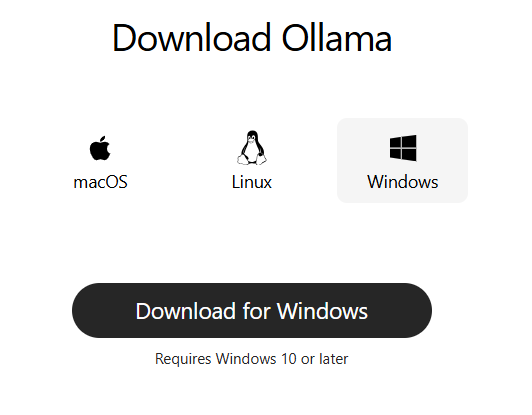
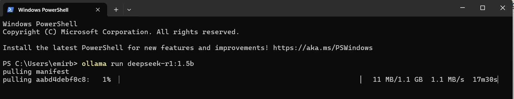
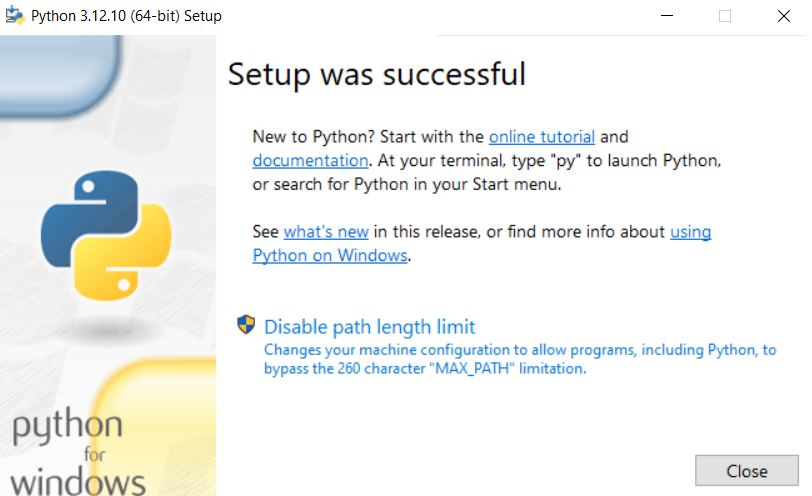
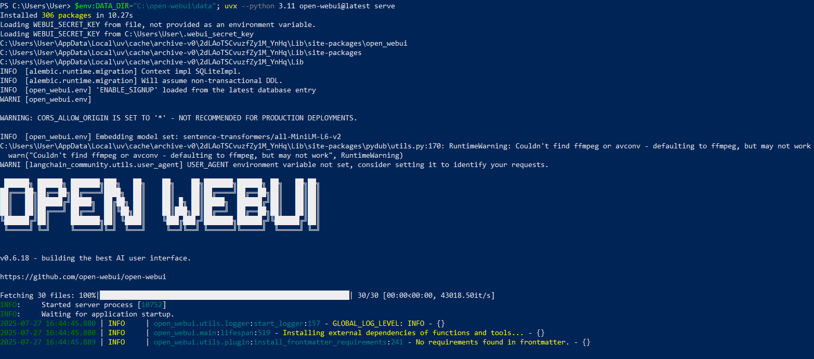

# AYAĞA KALDIRMA AŞAMALARI
## İÇİNDEKİLER
- 
- 
# KURULUM DÖKÜMANTASYONU
## İÇİNDEKİLER
### 1. OLLAMA KURULUMU
- MİSTRAL:7B
- MİSTRAL-NEMO:12B
-  deepseek-r1:1.5b

### 2. VISUAL STUDIO KOD KURULUMU

### 3. PYTHON KURULUMU

### 4. EKRAN KARTI DRİVERLARI KURULUMU

- CUDA TOOLKİT

### 5. DOCKER KURULUMU

### 6. GİT KURULUMU

### 7. GİTHUB DESKTOP KURULUMU

### 8. CURSOR KURULUMU

### 9. Open WebUI KURULUMU

### 10. MULTIPASS KURULUMU

----------

# 1.OLLAMA KURULUMU
 **Proje Gereksinimi**

OLLAMA, bu projede  Mistral ve DeepSeek gibi LLM modellerini lokal olarak çalıştıran bir altyapı görevi görmüştür. Bu altyapı sayesinde modellerle etkileşim kurmak, onlardan doğal dil çıktıları almak mümkün olmuştur.

**Kurulum Öncesi Gereksinimler**

- İşletim Sistemi: Windows 10 veya üzeri, macOS ya da Linux kullanıyor olmalısınız.Kurulum sırasında internet bağlantısı gereklidir.En az 1 GB boş alan olmalıdır.

 **Kurulum Aşamaları**

- Ollama resmi sitesine giriş yapıldıktan sonra "DOWLAND" sekmesine tıklanarak bilgisayarın işletim sistemine göre seçim yapılır.

   
- İndirme klasörüne gidildikten sonra “ollama-setup.exe”  dosyasına çift tıklanır.Kurulum sihirbazı açılır.
  
   
- Kurulum sihirbazındaki talimatlar takip edilir.“Next” (İleri) butonuna tıklanılır.Lisans sözleşmesini okuyup "I Agree" seçeneği işaretlenir.Kurulum klasörünü onaylanır veya değiştirilir."Finish"  butonuna basılır.
  
   

**Kurulumun Doğrulanması**
 - Bilgisayarda Başlat menüsüne  gidilir.
 - “OLLAMA” programını aratılır ve açılır.
 - Komut satırı açılırsa, ollama version yazıp Enter’a basılır.
 - Kurulu sürüm numarası ekranda görünüyorsa kurulum başarılıdır.

 # MISTRAL-NEMO:12B MODELI
  **Proje Gereksinimi**
 
  Mistral NeMo 12B modeli, NVIDIA tarafından optimize edilmiş, büyük ölçekli ve güçlü bir dil modelidir. 12 milyar parametreye sahip olan bu model Daha fazla bağlam işleyebilme ve kompleks istekleri daha iyi anlayabilme kapasitesi sağlar. Özellikle büyük modellerin hızlı yanıt verebilmesi için CUDA ile GPU üzerinden çalıştırılabilir.
 
  **Kurulum Öncesi Gereksinimler**
  - NVIDIA GPU en az 16GB VRAM önerilir.
  - CUDA desteği gereklidir
  - Python en güncel sürümü gereklidir.(3.12.9 vb)
  - NVIDIA PyTorch (GPU destekli) gereklidir.
  - NVIDIA NeMo kütüphanesi kurulmalıdır.
 
 **Kurulum Aşamaları**
 - Öncelikle Python 3.8+ ve PyTorch yüklü olmalıdır.
 - PyTorch'u resmi sitesinden sistemine ve CUDA sürümüne uygun şekilde kurabilirsiniz:
 ` pip install torch torchvision torchaudio
 `
 - Model ağırlıklarını PyTorch formatında indirin veya otomatik indirme için script’i çalıştırınız:
 
   `import torch`
 
   `from mistral_nemo import MistralNemoModel`
    `model = MistralNemoModel.from_pretrained('mistral-nemo-12b')`
 
    `model.eval()`
 
 - CUDA kullanmak için:
 
   `device = torch.device('cuda' if torch.cuda.is_available() else 'cpu')`
 
   `model.to(device)`
 
  - Ollama dokümantasyon linkine gidildikten sonra modeller sayfasına geçilir ve buradan "mistral-nemo 12:b modeli" seçilir.
  
 
  - Terminal ekranına aşağıdaki komut yazılır ve çalıştırılır:
  
 
  
 
 **Kurulumun Doğrulanması ve Kullanım**
 - Ollama arayüzüne ya da terminaline aşağıdaki komutu girin:
 
   `ollama list`
 
    Bu komut ile yüklü modeller listelenecektir.Eğer listede modelin ismi gözüküyor ise model yüklenmiş demektir.

# deepseek-r1:1.5b MODELI
**Proje Gereksinimi**

Projede, doğal dilde ifade edilen kullanıcı isteklerinin hızlı ve kaynak dostu bir şekilde analiz edilmesi amaçlandığından, DeepSeek-R1:1.5B modeli tercih edilmiştir. 1.5 milyar parametreye sahip olan bu model, özellikle hafif sistemlerde, hızlı yanıt süreleri ve temel doğal dil anlama görevlerinde yüksek doğruluk oranı ile öne çıkmaktadır.

**Kurulum Gereksinimleri**
- Ollama uygulamasının önceden kurulu olması gerekiyor eğer kurulu değilse dökümantasyona bakılarak kurulması gerekiyor.
- Windows, macOS veya Linux işletim sistemlerine kurulabilir.
- En az 3 GB boş disk alanı önerilir.

**Kurulum Aşamaları**
- Ollama dokümantasyon sayfasından modeller kısmından `deepseek-r1:1.5b` modeli bulunur ve üzerine tıklama gerçekleştirilir.

- Modele tıklanıldığında uygun parametreli olan modelin komutu alınır.
 

- Terminal veya Windows Powershell komut ekranı açıldıktan sonra aşağıdaki komut girilir:

   `ollama run deepseek-r1:1.5b`

Bu komut modeli otomatik olarak indirir ve başlatır.Komut çalıştıktan sonra model aktif hale gelir ve ilk girdiyi bekler.

**Kurulumun Doğrulanması ve Kullanım**

- Eğer kurulum başarılıysa, terminal ekranında şu benzeri bir mesaj göreceksiniz:
   
   `> Hello! How can I assist you today?`

Ardından örnek bir metin yazarak modeli test edebilirsiniz:
   
 ` User: Yapay zeka hakkında kısa bir paragraf yaz.`

# 2.VISUAL STUDIO CODE KURULUMU
**Proje Gereksinimi**

Visual Studio Code; ücretsiz ve açık kaynaklı bir kod editörüdür.Python, JavaScript, C++, HTML gibi birçok dili desteklediği için projenin geliştirme ortamı olarak kullanılmıştır.

**Kurulum Gereksinimleri**
- Windows 10 ve üzeri, macOS veya Linux işletim sistemi gerekir.
- En az 200 MB boş disk alanı önerilir.

**Kurulum Aşamaları**
- Web tarayıcınızdan şu adrese gidiniz:

   https://code.visualstudio.com/

- İşletim sisteminize uygun olan butona tıklayınız.

- İndirilen kurulum dosyasını açınız. Aşağıdaki gibi bir dosya karşınıza çıkacaktır:

- Lisans sözleşmesini kabul edin:  "I accept the agreement" seçeneğini işaretleyin, "Next" tuşuna basınız.

- Kurulum klasörünü seçiniz (varsayılan kalabilir),"Next"
- Başlat menüsüne eklenmesini onaylayınız, "Next"
- Masaüstü simgesi, sağ tık menüsü, PATH’e ekleme gibi seçenekleri işaretleyiniz.

- "Install" tuşuna basarak kurulumu başlatınız.

---

---

**Kurulumun Doğrulanması ve Kullanım**
-  Başlat menüsüne “Visual Studio Code” yazınız ve programı açınız.
-  Program açıldığında sol üstte “Welcome” ekranı gelirse kurulum başarıyla tamamlanmıştır.
- Ardından editör üzerinde gerekli eklentilerin(Python vs) kurulumu gerçekleştirilir.

# 3.PYTHON KURULUMU
**Proje Gereksinimi**

Python dili, sözdizimi açısından basit olması ve zengin kütüphane desteği sayesinde kullanım kolaylığı sunduğu için projenin geliştirilmesinde tercih edilmiştir.

**Kurulum Gereksinimleri**
- Windows 10 veya üzeri bir işletim sistemi gerekir.
- Yönetici (admin) yetkilerine sahip bir kullanıcı gerekir.

**Kurulum Aşamaları**
- Tarayıcınızdan şu bağlantıya gidiniz:

   https://www.python.org/downloads/
- Site üzerinde "Dowlands" kısmında sisteminize uygun olan Windows installer (64-bit) sürümünü indiriniz:

- `Windows installer (64-bit) — python-3.12.9-amd64.exe`

- İndirilen `.exe` dosyasını çift tıklayarak çalıştırınız.

- Kurulum ekranında "Add Python 3.12 to PATH" seçeneğini mutlaka işaretleyiniz.

- Ardından "Install Now" butonuna tıklayınız.

-  Kurulum tamamlandığında "Setup was successful" mesajı göreceksiniz.

**Kurulum Doğrulanması ve Kullanım**
- Başlat Menüsü → cmd yazarak Komut İstemi’ni açınız.
- Aşağıdaki komutu yazın ve çalıştırın:

   `python --version`

# 4.CUDA KURULUMU
**Proje Gereksinimi**

Bu projede kullanılan Mistral NeMo 12B gibi büyük dil modelleri, yüksek işlem gücü gerektirdiği için GPU destekli çalışma ortamına ihtiyaç duyar. GPU’lar ise CUDA platformu aracılığıyla programlanabilir.Bu nedenle, CUDA kurulumu, modelin performanslı ve sorunsuz çalışabilmesi için temel bir gereksinimdir.Bu projede CUDA'nın "12.9.1" sürümü tercih edilmiştir.

**Kurulum Gereksinimleri**

- Windows 10/11 (64-bit) işletim sistemi gerekir.
- CUDA destekleyen bir NVIDIA ekran kartı sistemde bulunmalıdır.
- En güncel NVIDIA driver yüklü olmalıdır.
-  Eğer CUDA, Python ile birlikte kullanılacaksa, CUDA sürümünün desteklediği bir Python sürümü sistemde yüklü olmalıdır.

**Kurulum Aşamaları** 

- Web tarayıcınızdan şu bağlantıya gidiniz:

   https://developer.nvidia.com/cuda-12-9-1-download-archive

- NVIDIA CUDA Toolkit resmi web sitesi açılmıştır. Buradan işletim sistemine göre CUDA kurulumu başlatılır.

- İndirilen .exe dosyası çalıştırılır. - Kurulum sihirbazı başlar. 

- Lisans sözleşmesi kabul edilir.

- Express seçeneği seçilir ve tüm gerekli bileşenler otomatik kurulur.

---
- Driver, Toolkit, Nsight, VS Integration gibi bileşenler listelenir ve seçim gerçekleşir.Yükleme süreci başlar, yükleme çubuğu yavaş yavaş ilerler.
   

   
- NVIDIA ekran kartı sürücüsü (Graphics Driver), CUDA Toolkit kurulumu sırasında otomatik olarak yüklenir. Bu ekran, sürücünün ve yardımcı bileşenlerin başarıyla kurulduğunu gösterir. "Close" butonuna tıklayarak sürücü kurulum penceresi kapatılır.

**Kurulum Doğrulanması ve Kullanım**
-  Komut İstemi (cmd) açınız ve şu komutu giriniz:
`nvcc --version`

 - CUDA Toolkit Dosyası Kontrolü yapınız:

   `C:\Program Files\NVIDIA GPU Computing Toolkit\CUDA\v12.9`

# 5. DOCKER KURULUMU
Docker, uygulamaları izole bir ortamda konteynerlarda çalıştırmamıza olanak sağlayan bir platformdur. Bu sayede aynı uygulama farklı bilgisayarlarda aynı şekilde çalışabilir.

**Proje Gereksinimi**

Geliştiricilerin farklı işletim sistemlerinde aynı ortamı kurmasını kolaylaştırmak, Python, FastAPI gibi bileşenlerin belirli versiyonlarda çalışmasını garanti olduğu için kullanılması tercih edilmiştir.

**Sistem Gereksinimleri**

Docker Desktop’u kullanabilmek için sisteminizde şunlar olmalı:

- Windows 10/11

- Hyper-V ve Virtualization özellikleri açık olmalı

- BIOS/UEFI'de "Virtualization" özelliği etkin olmalı

- En az 4 GB RAM önerilir

**Docker Desktop Kurulumu**
  
1. Docker’ın resmi sitesine gidin ve Windows için kurulum dosyasını indirin:

   https://www.docker.com/products/docker-desktop

1. İndirilen .exe dosyasını çift tıklayın.

2. Kurulum ekranında gelen adımları "Next" diyerek geçin.

3. Kurulum tamamlandığında bilgisayarınızı yeniden başlatın.
   
**Docker Kurulumunu Doğrulama** 

Kurulumdan sonra Docker Desktop otomatik açılır. Açılmazsa masaüstünden çalıştırın.
- Terminal/Powershell üzerinden test:
  
  Terminalinizi windows tuşuna bastıktan sonra cmd veya powershell yazarak açabilirsiniz. Ardından aşağıdaki komutu giriniz:

  `docker --version` 

    Çıktı şöyle olmalı:

     `Docker version 24.x.x, build abcdefg`

**Docker Desktop Ayarları**
Docker Desktop açıldıktan sonra:

- Settings > Resources > WSL Integration kısmından hangi dağıtımın Docker ile çalışacağını belirleyebilirsiniz.

- Settings > Resources > Memory/CPU kısımlarından Docker’a ayrılacak kaynakları ayarlayabilirsiniz.
  
# 6. GIT KURULUMU
**Git Nedir?**

Git, kod değişikliklerini izlemek ve takım halinde geliştirmeyi kolaylaştıran versiyon kontrol sistemidir.

GitHub, GitLab gibi platformlarla entegrasyonu sayesinde yaygın olarak kullanılır.

**Proje Gereksinimi**

Hatalı güncellemeler veya istenmeyen değişiklikler durumunda önceki sürümlere geri dönme imkânı sunup proje geliştirme sürecinde yapılan değişikliklerin kolayca izlenmesi ve yapılan tüm değişiklikler kayıt altında tutulup kimin ne zaman ne yaptığı kolayca görülebildiği için tercih edilmiştir.

**Git’i İndirme**

1. Git'in resmi sitesine gidin ve Windows için kurulum dosyasını indirin:

    https://git-scm.com/downloads/win
2. İndirilen `.exe` dosyasını çalıştırmak için çift tıklayın.

**Kurulum**

Kurulum boyunca gelen adımları şu şekilde tamamlayın:

1. **License (Lisans)**: Devam etmek için "Next" tıklayın. 

2. **Kurulum Dizinini Belirle**: Varsayılan klasörü kabul edin, ya da dilediğiniz başka bir yere yükleyin.  

3. **Bileşen Seçimi**: Varsayılan seçeneklerle devam edin; ek bir bileşene gerek yok.  
4. **Başlat Menüsü**: Kısayol oluşturmak için ilerleyin.  
5. **Varsayılan Metin Editörü**:  
   - Başlangıç için Notepad++, VS Code ya da Nano önerilir.  
6. **Başlangıç Dalı (branch)**: Genelde `master` veya `main`. Devam edin.  
7. **PATH’e Ekleme**: Orta seçenek, yani hem Git Bash hem CMD’de kullanılabilir olsun.  
 
8. **SSH istemcisi**: Default “OpenSSH” seçili kalsın.  
 
9. **Satır sonu dönüşümleri**: "Checkout Windows-style, commit Unix-style" seçeneğini kullanın.  
 

    

    

    

10. **Terminal Emülatörü**: Varsayılan olarak **MinTTY** önerilir.  
11. **Git pull davranışı**: Varsayılan seçimi tercih edin.  
12. **Kimlik bilgisi yöneticisi (Credential Manager)**: Varsayılan bırakılabilir.  
13. **Ek seçenekler & deneysel özellikler**: Aynı şekilde varsayılan seçenekleri kullanın.  

Tekrar "Install" diyerek kurulumu tamamlayın.

   

     
**Kurulumu Doğrulama**

Kurulum tamamlandığında Git Bash veya CMD/Powershell açarak aşağıdaki komutla kontrol edin:

`bash git --version`

Çıktı şöyle olmalı:

`git version 2.50.1`

**İlk Temel Konfigürasyon**

Kendi isminizi ve e-posta adresinizi girerek Git’i tanıtın:

`git config --global user.name "Adınız Soyadınız"`

`git config --global user.email "eposta@ornek.com"`

Bu bilgiler, yaptığınız tüm commit (kaydetme işlemleri) sırasında etiketlenecektir.

**Projeyi test etmek için ilk Git Reposu**

`mkdir test-repo` → yeni klasör oluşturur

`cd test-repo` → bunu Git deposu yapar

`git init` → bir dosya ekler 

`git commit -m "İlk commit - test"` → ilk kaydı yapar.

Artık Windows üzerinde Git kurulumunuzu tamamladınız! Kullanım için aşağıdaki örnekleri de uygulayabilirsiniz.

`git status` → Depodaki değişiklikleri gösterir

`git add .` → Tüm değişiklikleri ekler

`git commit -m "Açıklama"` → Değişiklikleri kaydeder
`git help` → Git komutları hakkında yardım alırsınız

# 7. GITHUB DESKTOP  KURULUMU

**GitHub Nedir?**

 Geliştiricilerin projeleri paylaşmasını, işlemesini ve birlikte çalışmasını sağlayan çevrim içi bir platformdur.

**Proje Gereksinimi**

 Birden fazla kişi ile eş zamanlı çalışmak, kodları paylaşmak ve katkıları yönetmek, açık kaynak desteği ve proje dosyalarının herhangi bir arızada kaybolmasını önlemek amacıyla güvenli bir şekilde çevrimiçi yedeklenmesi için GitHub tercih edilmiştir.

**İndirme ve Kurulum**

- GitHub Desktop’ı buradan indirin:  
   https://desktop.github.com/ 

   

   

   

- İndirilen `.exe` dosyasını çift tıklayarak çalıştırın.

- Kurulum tamamlandıktan sonra otomatik açılır.
  

**Hesapla Giriş**

- Açılan ekranda **Sign in to GitHub.com** seçeneğini tıklayın.  
   
- GitHub hesabınızla giriş yapın.  
- Artık projelerinizi görsel arayüz üzerinden yönetebilirsiniz

**Kurulum Doğrulama**

- Başlat menüsünden GitHub Desktop yaz ve tıkla.

- Uygulama sorunsuz açılıyorsa kurulum tamamdır.

# 8. CURSOR KURULUMU
**Proje Gereksinimi**

Projenin frontend (ön yüz) geliştirme aşamasında AI destekli kod önerileri almak ve geliştirme sürecini hızlandırmak amacıyla kullanılmıştır. VS Code eklentileriyle uyumlu, yerel LLM destekli modern bir editör olması nedeniyle tercih edilmiştir.

**Kurulum Gereksinimleri**
-  Bilgisayarda Windows, macOS veya Linux işletim sistemi bulunmalıdır.
- Yapay zekâ tabanlı kod tamamlama özelliklerini kullanabilmek için OpenAI API anahtarı veya yerel bir LLM (örneğin: Mistral 7B) Ollama ile kurulu olmalıdır.
-  Cursor’un tam performansla çalışabilmesi için sistemde Node.js, Python, veya diğer dil araçlarının PATH’e eklenmiş olması önerilir.

**Kurulum Adımları**

-  Cursor’un resmi web sitesine gidiniz:

     https://cursor.com/downloads
 
- İşletim sisteminize uygun olan Cursor sürümünü indiriniz.(Windows tercih edildi.)

-  İndirilen kurulum dosyasını çalıştırarak kurulumu başlatınız.
 
- Kurulum başladıktan sonra ek simgeler ekle alanında gerekli simgeler seçilir ve sonraki işleme geçilir.
 

- Kurulum tamamlanır.

    
 
**Kurulum Doğrulanma ve Kullanım**
- Cursor uygulamasını başlatınız.
- Sol altta yer alan "Ask AI" veya "Chat" butonunun görünür olduğundan emin olunuz.
-  Ayarlar menüsüne girin (Ctrl + ,) → "AI Settings" sekmesini kontrol ediniz.Burada model aşağıdaki gibi seçilmiş olmalıdır:
görsel
-  Bir proje klasörü açın ve Ctrl + P ile dosya arama özelliğini test ediniz.Dosya içeriği hızlıca yüklenebiliyorsa editör düzgün çalışıyor demektir.

# 9. Open WebUI KURULUMU
**Open WebUI Nedir?**

Localde LLM (Large Language Model) çalıştırmak için görsel bir arayüz sunan açık kaynak bir projedir. Ollama veya OpenAI API desteklenir. Kendi bilgisayarında özel bir ChatGPT benzeri arayüz oluşturmanı sağlar.

**Proje Gereksinimi**

Python üzerinden pip ile kolayca kurulabilen ve tarayıcı üzerinden çalıştırılabilen hafif bir arayüz sunar. İnternete ihtiyaç duymadan yerel ortamda çalışabilir, bu da veri güvenliği açısından büyük avantaj sağlar. LLaMA, Mistral gibi büyük dil modelleriyle doğrudan entegre çalışabilir. FastAPI gibi backend sistemleriyle kolaylıkla entegre edilerek istenen komutları web arayüzü üzerinden çalıştırabilme imkânı tanıdığı için tercih edilmiştir.

**Kurulum**

-  UV çalışma zamanı yöneticisi, açık webui gibi uygulamalar için kesintisiz python ortam yönetimi sağlar. Başlamak için uv terminalden aşağıdaki komutu kullanarak yükleyin
  `powershell -ExecutionPolicy ByPass -c "irm https://astral.sh/uv/install.ps1 | iex"`

    
  
  - UV kurulduktan sonra veri kaybını önlemek için Data_DIR ortam değişkeninin ayarlanmasını sağlayarak aşağıdaki komutu kullanın.

    `$env:DATA_DIR="C:\open-webui\data"; uvx --python 3.11 open-webui@latest serve`

       

- Kurulum tamamlandıktan sonra OPEN WebUI tekrar açmak şu komutla başlat:

   `open-webui serve`

    
- Sunucu ayağa kalktıktan sonra tarayıcından http://localhost:8080 adresine giderek arayüzü görebilirsin.
  
   

# 10. MULTİPASS KURULUMU
**Proje Gereksinimi**

Bu projede Multipass, kullanıcıdan alınan doğal dil komutları doğrultusunda otomatik olarak sanal makineler oluşturmak ve yönetmek amacıyla kullanılmıştır. Kullanıcıların teknik bilgiye ihtiyaç duymadan, yalnızca yazılı ifadelerle ihtiyaçlarını belirtmeleri yeterlidir. Proje, bu ifadeleri yorumlayarak uygun Multipass komutlarını çalıştırır ve sanal makineleri arka planda hazırlar. 

**Kurulum Gereksinimleri**

- Multipass; Windows 10/11, macOS (10.14+), ve Ubuntu 18.04 ve sonrası sürümlerinde çalışabilir.
- Hyper-V, VirtualBox, WSL2, veya KVM gibi sanallaştırma araçlarından biri yüklü olmalıdır.
- BIOS/UEFI ayarlarında sanallaştırma (VT-x/AMD-V) açık olmalıdır.
- En az 5-10 GB boş disk alanı olmalıdır.
- Her VM için en az 1-2 GB RAM ve uygun CPU kaynağı gerekir.

**Kurulum Adımları**
- Multipass’in resmi web sitesine gidiniz:

  https://canonical.com/multipass
 
- Windows işletim sistemi için uygun olan dosyayı indiriniz.
- İndirilen dosyaya çift tıklayarak yükleyiciyi başlatınız.
 

- Kurulum sihirbazında sırasıyla “Next” butonlarına tıklayarak lisans sözleşmesini kabul ediniz ve kurulum dizinini onaylayınız.
 
- Kurulum işlemi sırasında, Windows için uygun bir sanallaştırma sağlayıcısı seçmeniz gerekebilir (örneğin: Hyper-V, VirtualBox, WSL2).
 

- PATH eklenti sayfasında da sisteme uygun olan seçeneği işaretledikten sonra "Next" tuşuna basınız.

    

- Multipass 'in indirileceği klasörü seçiniz.
 

- "İnstall butonuna basarak kurulum işlemini başlatınız.
 

- Eğer VirtualBox kullanmak istiyorsanız, önce VirtualBox’ın sisteminize kurulu olması gerekir.
- VirtualBox kuruluysa, şu komutla Multipass’i ona yönlendirebilirsiniz:

  ` multipass set local.driver=virtualbox`
 

    
- Kurulum tamamlandıktan sonra bilgisayarı yeniden başlatmanız önerilir.

**Kurulum Doğrulanması ve Kullanım**
- Bir terminal ekranı açarak aşağıdaki komutu giriniz:

  ` multipass version` veya `multipass --version`

    

                                                              